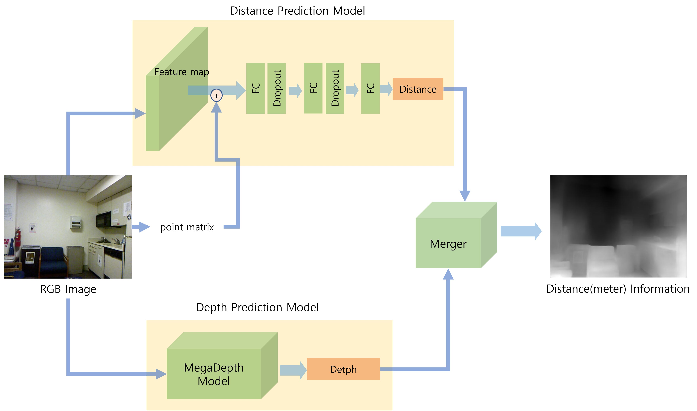
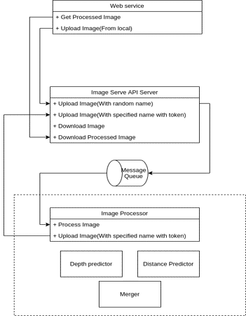

# Measuring-Image-Distance
2D 이미지의 픽셀 단위 미터 거리 측정 모델, 배포 졸업프로젝트.


## [Presentation PDF](result/Final-Presentation.pdf)
# Model Overview

아래의 두 논문과 해당 모델들을 결합하여 개발.
- Distance Predictor
  - Learning Object-Specific Distance From a Monocular Image
- Depth Predictor
  - MegaDepth: Learning Single-View Depth Prediction from Internet Photos

1. n개의 픽셀을 개별적으로 Distance Predictor에 통과시켜 n개의 픽셀에 대한 미터 단위의 거리 정보를 획득.
2. Depth Predictor로 전체 이미지에 대한 깊이 정보 획득.
3. Merger에서 1번, 2번의 정보를 조합.
4. 전체 픽셀에 대한 미터 단위의 거리 정보 획득.

# Service Overview

- Front-end Web service: React
- Image Serve API Server: FastAPI
  - Upload raw image and download depth image.
  - Send image to Message Queue
- Message Queue: RabbitMQ
- Image Processor
  - Receive image from Message Queue.
  - Call Predictor.
  - Return processed image to Message Queue.
# Requirements
- service/worker/requirements.txt

# Train
## Using Colab
1. Open "train_in_colab.ipynb" in colab.
2. Move 'nyu_depth_data_labeled.mat' to google drive and set path in colab.
3. If you want to use TPU, start with first cell.
4. If you want to use GPU, start with 'Train distance via colab'.

## Using local GPU
```sh
cd service/worker/predict
python train_ny_data.py
```
# Test Predictor
```sh
$ cd service/worker
$ python test_predict.py
```

# Test Evaluation
```sh
$ cd service/worker
$ python eval.py
```


# API server and worker
[API README.md](service/README.md)

# Contributor

- 박성호(팀장)
  - 모델 개발, 학습, 평가
  - 보고서 작성
- 김아영
  - 논문 리뷰/분석
  - Data 수집/검증
- 박종엽
  - Front-end 웹 서비스
  - API 서버
  - Image Processor 개발
- 손도희
  - 논문 리뷰/분석
  - Data 검증/수집
  - Front-end 웹 서비스

# Reference
- MegaDepth: Learning Single-View Depth Prediction from Internet Photos
  - Cornell University/Cornell Tech (2018)
  - https://www.cs.cornell.edu/projects/megadepth/ 

- Learning Object-Specific Distance From a Monocular Image
    - Cornell University (2019)
    - https://openaccess.thecvf.com/content_ICCV_2019/papers/Zhu_Learning_Object-Specific_Distance_From_a_Monocular_Image_ICCV_2019_paper.pdf

- Faster R-CNN: Towards Real-Time Object Detection with Region Proposal Networks
    - https://arxiv.org/pdf/1506.01497.pdf
